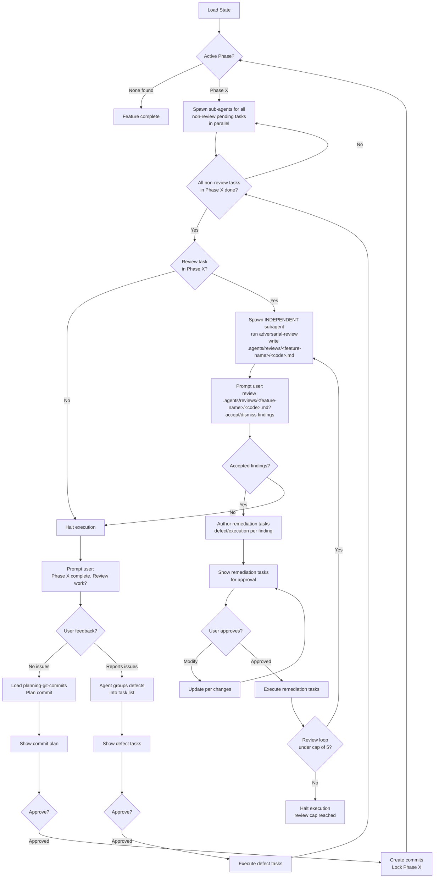

# When To Use

Use when a feature spec exists in `.agents/features/<name>/` and its tasks need implementation. The agent reads the feature state, determines the active phase, and resumes or begins execution — always operating per-phase, spawning sub-agents for all pending tasks in parallel.

> **Prerequisite**: Load the [executing-skills](../executing-skills/SKILL.md) skill before running this pipeline. It governs how skills are loaded, executed, and verified.

# Orchestrator Role

The agent running this skill acts as an **orchestrator**. Its strict responsibilities:

- Schedule tasks and determine execution order (including which tasks can run in parallel).
- Spawn sub-agents for every pending task; generate new tasks from reviewer feedback.
- Supervise loop limits (see the review-loop cap in Step 4).
- Operate **per-phase only** — never execute more than one phase at a time.

The orchestrator and every spawned sub-agent MUST load and apply [caveman-reasoning](../caveman-reasoning/SKILL.md) to their internal reasoning trace. Inter-agent communication (task handoff notes, MEMORY.md free-form prose, review-feedback summaries) uses [caveman-compression](../caveman-compression/SKILL.md) — never compress frontmatter, MEMORY.md `Handoff`/`Deviations`, or TASK.md `Requirements`.

# Subagent Spawning

Spawn sub-agents appropriate to effort. Use generic capacity tiers (match to whatever models your environment exposes — do not hardcode model names):

| Effort | Examples | Capacity tier |
|---|---|---|
| **Low** | formatting, linting, simple typos | Lower-capacity model |
| **High** | writing new logic, fixing adversarial-review findings, refactoring | Higher-capacity model |

## Verification Commands

Do not assume a specific toolchain. Instruct every spawned sub-agent to **consult the project manifest** (e.g., `package.json`, `Cargo.toml`, `pyproject.toml`) to discover the available verification commands (typically: test, lint, format, build, typecheck). If a sub-agent is unsure which commands exist, it must read the manifest before relying on any command. Never invent commands.

# Pipeline

## 1. Load State

- Locate `.agents/features/<name>/`.
- Read FEATURE.md, all TASK.md files — note `type`, `depends-on`, `status`.
  - Read each task's MEMORY.md and, if present, its GATES.md.
  - Validate the spec:
    - FEATURE.md exists and parses correctly (valid YAML frontmatter)
    - All TASK.md files have valid YAML frontmatter
    - All `status` values are in the canonical enum (`pending | in-progress | complete | blocked`)
    - `locked-phases` is parseable as a comma-separated list
    - If any status value is not in the canonical enum, coerce it to `blocked`, log a deviation in the task's MEMORY.md, and warn the user
- Map tasks as: `complete`, `in-progress`, `pending`, `blocked` — the canonical status enum defined in [authoring-feature-spec](../authoring-feature-spec/SKILL.md). Do not invent other status values (e.g. `defect`).
  - Determine active phase: the first phase with any pending/in-progress tasks. Phases listed in FEATURE.md `locked-phases` are skipped (already committed and locked).
  - If a task has `type: defect` child tasks that are still `pending` or `in-progress`, set the parent task's `status: blocked` (per the canonical enum in authoring-feature-spec) and do not treat it as actionable until those children close. To find a task's open defect children, scan all TASK.md files within the active phase's task directories whose `originator` is `defect:<this-id>`. The `related-tasks` field is an optional cross-reference only and is not used for blocking.
  - On re-entry, read the review loop counter from the review task's `MEMORY.md` (under `## Review Loop Counter`) to resume the review loop at the correct iteration. If the counter is absent, start at iteration 1.

## 2. Execute Phase

Spawn sub-agents for pending tasks in the active phase, in dependency order:

- **`interruptor` = hard stop.** After each task completes, re-check all `interruptor` tasks in the active phase. If an interruptor's `depends-on` tasks are all `complete`, halt spawning immediately — do not spawn any further tasks and present the interruptor's context for a required user decision. An `interruptor` must never run in parallel with other work.
- **`review` tasks are excluded** from the parallel spawn — they run after the non-review tasks complete (see Step 4) via an independent subagent.
- **`planning` tasks must wait** for any in-phase `exploratory`/`execution`/`defect` tasks listed in their `depends-on` to reach `complete` before being spawned; do not run them in parallel with unfinished dependencies (planning tasks wait for dependencies).
- All other pending tasks whose `depends-on` is satisfied may run in parallel.

Sub-agents MUST read the `MEMORY.md` of any tasks listed in their `depends-on` frontmatter to ingest prior context and handoff instructions. Apply [caveman-compression](../caveman-compression/SKILL.md) **only to free-form prose** when writing files — never compress frontmatter or MEMORY.md `Handoff`/`Deviations` sections and TASK.md `Requirements` (compression scope limited to free-form prose).

## 3. Execute Based on Task `type`

Each task's `type` (in TASK.md frontmatter) determines behavior:

| type | Behavior |
|---|---|
| **exploratory** | Scout — read code, map dependencies. Reference `finding-references` if reference source/docs exist locally. Store findings in MEMORY.md. |
| **planning** | Ingest exploration context from MEMORY.md. Design approach, update TASK.md, spawn new tasks if needed. May have GATES.md verifying facts. |
| **execution** | Write/modify code. May optionally have GATES.md for validation (test, lint, format). |
| **interruptor** | Hard stop. Present context, ask user question. Complete only after user answers. |
| **defect** | Fix bugs from phase reviews. Same as execution, focused on `related-tasks`. |
| **review** | Run by an **INDEPENDENT subagent** (never the agents that authored/executed the phase). Execute the `adversarial-review` skill over the completed phase and write findings to `.agents/reviews/<feature-name>/<code>.md`. Block completion on human review of the review file; accepted findings become `defect`/`execution` remediation tasks. |

Before executing a task, check the `FEATURE.md` task table's `Gates` column. If `Yes`, the sub-agent must execute and pass `<task-dir>/GATES.md` before marking the task complete. If the column says `Yes` but no `<task-dir>/GATES.md` exists, treat the task as failed and report the mismatch. Conversely, if the `Gates` column says `No` but a `<task-dir>/GATES.md` exists on disk, warn and execute its gates anyway.

## 4. End-of-Phase Review & Defect Loop

When all **non-review** tasks in the current Phase complete:

1. **Halt execution.**
2. **If the phase contains a `review` task** → run the independent-subagent review flow, subject to a **review-loop cap of 5 iterations** (see Review Loop Counter below):
        - **Construct the review scope:** collect all file paths modified by completed tasks in the phase (from their MEMORY.md handoff notes or git diff). Pass this scope to the review subagent as the review target.
        - Spawn an **independent subagent** (distinct from any agent that authored or executed tasks in this phase) to execute the `adversarial-review` skill over the completed phase. The subagent writes its findings to `.agents/reviews/<feature-name>/<code>.md`.
        - **Prompt user:** "Phase <X> review ready. Review `.agents/reviews/<feature-name>/<code>.md`?" Present the findings.
- For each **accepted** finding, author a remediation task (`type: defect` or `execution`) with `finding-ref: <F<n>>` in its frontmatter linking to the specific finding ID. Determine the new task ID by scanning existing tasks in the active phase and incrementing the highest number, using zero-padded three-digit numbering (A001–A999).
        - For each **dismissed** finding, record the reason in the finding's `### Discussion` thread as a `[Human]` turn.
       - Create the remediation task directories (`<PHASE_LETTER><NNN>-<name>/`) within the active phase namespace. Do not nest tasks inside other task directories.
       - Update the Task Table in `FEATURE.md` to include the remediation tasks.
       - Present the remediation task list to the user for approval or modification; iterate until approved.
       - **Execute remediation tasks** with sub-agents (same as step 2). After execution, re-run the independent-subagent review (loop back to the adversarial-review step) until no accepted findings remain.
       - **Review Loop Counter:** increment a per-phase counter in the review task's `MEMORY.md`, under a `## Review Loop Counter` section, each time the adversarial-review→remediation cycle re-runs. The maximum cap is **5 iterations**. If the counter reaches 5 while accepted findings remain, **halt execution** and report the unresolved findings to the user rather than continuing the loop.
       - Keep the `review` task `status` as `pending` throughout the review/defect loop. Only mark it `complete` after the human reports "no issues" at the Phase X complete prompt (step 3).
3. **Prompt user:** "Phase <X> complete. Review work?" (manual catch-all beyond the `review` task).
4. **If user reports issues** → agent groups reported issues into defect tasks:
        - Each defect task gets `type: defect`, `originator: defect:<parent-task-id>` linking to the originating task in the same phase.
        - Determine the new task ID by scanning the existing tasks in the active phase (e.g., A001, A002) and incrementing the highest number (e.g., A003).
        - Create a standard task directory (`<PHASE_LETTER><NNN>-<name>/`) for each defect task within the active phase namespace. Do not nest tasks inside other task directories.
       - Update the Task Table in `FEATURE.md` to include the newly appended defect tasks.
       - Present the generated defect task list to the user for approval or modification.
       - Iterate until user approves the proposed defect tasks.
5. **Execute defect tasks** with sub-agents (same as step 2).
6. **Loop back** to step 3 (review again) until user reports no issues.

## 5. Per-Phase Commit

Once user approves phase with no issues:

1. Load [planning-git-commits](../planning-git-commits/SKILL.md).
2. Plan commits and show plan to user.
3. Wait for user approval or modification requests.
4. Iterate until user approves.
5. Create commits. Append the completed phase letter to FEATURE.md frontmatter `locked-phases` (comma-separated, e.g. `A,B`) to lock it, then proceed to the next phase. A locked phase is skipped on re-entry (see Step 1).

# Reference

- **GATES.md**: [GATES.md](../authoring-feature-spec/templates/GATES.md) (MUST READ)
- **[authoring-feature-spec](../authoring-feature-spec/SKILL.md)** — Authoring pipeline for feature specs with phased task breakdown and validation gates
