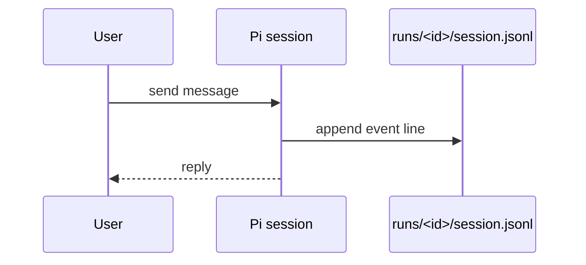
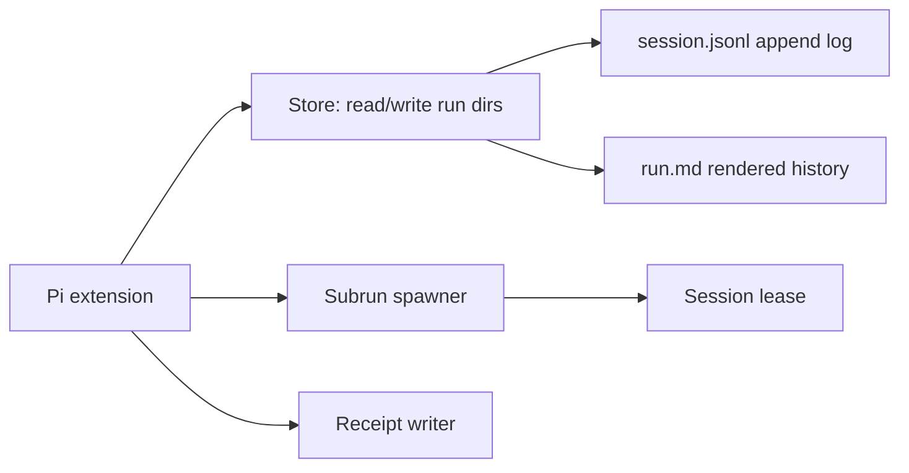

# Architecture

Choose where pi-runs sessions live and how they override default Pi behavior.

## Location

Store everything under `.agents/@montflow/pi-runs/` in the current repo. One run equals one Pi session — no mirror copy.

```text
.agents/@montflow/pi-runs/
  runs/<run-id>/session.jsonl
  runs/<run-id>/run.md
  runs/<run-id>/receipt.md
  runs/<run-id>/subruns/<subrun-id>/session.jsonl
```

Why this path:

1. Repo-local — history travels with `git clone`, not `~/.pi`.
2. Lowercase, no spaces — matches package name `@montflow/pi-runs`.
3. Namespaced under `.agents/@montflow/` — see existing `loops/`, `profiles/`, `specs/`.
4. One root for wiki, runs, index — see [storage](./storage.md).

## How Pi flow changes

Pi points its session file at the run directory. The repo file is the session — not a copy.



Rules:

1. One run is one Pi session file — `runs/<id>/session.jsonl` is loaded directly.
2. No global-store write, no duplicate transcript — see [session model](./session-model.md).
3. Resume reopens the same file, never Pi's global store.
4. Parent run stores child `runId` pointer only, never child transcript.

## Components



- `Store` — Effect wrappers around file reads/writes, owned by `@montflow/pi-runs`.
- `Subrun spawner` — spawns a child Pi session in `subruns/`, writes `parent: <run-id>` frontmatter.
- `Lease` — single-writer guard copied from `pi-subagents`, see [pi-subagents lessons](./pi-subagents-lessons.md).
- `Receipt` — settlement proof (`done` / `failed`), copied from workflow settlement.

## Decisions

1. Files first, SQLite never for v1 — rationale in [storage](./storage.md).
2. Each run owns its Pi session file; subruns nest under `subruns/`.
3. Frontmatter links parent and child — schema in [session model](./session-model.md).

## See also

- [Session model](./session-model.md) for directory schema and frontmatter keys.
- [Storage](./storage.md) for file formats and git rules.
- [Pi-subagents lessons](./pi-subagents-lessons.md) for lease, receipt, and RPC reuse.
- [Index](./index.md) for page map.
