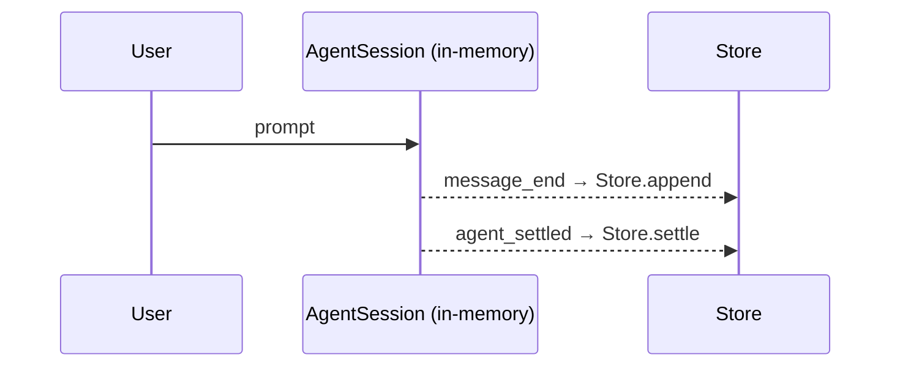
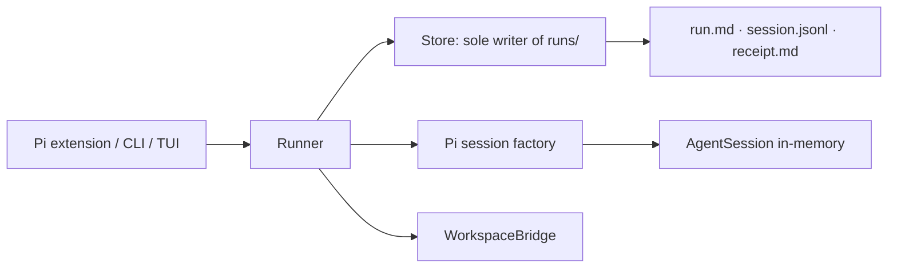

# Architecture

Where runs live and how they override default Pi behavior.

## Location

Store everything under `.agents/@montflow/runs/` in the current repo. The
layout is **flat**: `<root>/<run-id>/`, with no extra `runs/` level. One run
equals one Pi session.

```text
.agents/@montflow/runs/
  <run-id>/
    run.md          # descriptor frontmatter + rendered history (derived)
    session.jsonl   # append-only transcript — replay source of truth
    receipt.md      # written once on settle; terminal runs only
    .lock/          # ephemeral per-run write guard, never tracked
```

Why this path:

1. Repo-local — runs sit next to the code, not in `~/.pi`.
2. The store is git-ignored, so transcripts stay local and off `git diff`.
3. Namespaced under `.agents/@montflow/` alongside `specs/`, `profiles/`,
   `prompts/`, `runs/`.

## How Pi flow changes

Pi natively persists sessions under `~/.pi/agent/sessions/`. pi-runs does not
use that. The Pi session for a run is an in-memory `SessionManager`, and our
`Store` writes the durable transcript itself.


```mermaid
sequenceDiagram
  participant User
  participant Agent as AgentSession (in-memory)
  participant Store
  User->>Agent: prompt
  Agent-->>Store: message_end → Store.append
  Agent-->>Store: agent_settled → Store.settle
```

Rules:

1. One run is one Pi `AgentSession` built over `SessionManager.inMemory(root)`.
2. Pi never writes the run directory — `Store` is the sole writer.
3. Resume builds a fresh in-memory session and replays stored messages into it;
   see [process and recovery](./process-and-recovery.md).
4. A parent stores the child's id in `parent` frontmatter; there is no nested
   transcript copy and no `subruns/` directory.

## Components


```mermaid
flowchart LR
  Ext[Pi extension / CLI / TUI] --> Runner
  Runner --> Store[Store: sole writer of runs/]
  Store --> Files[run.md · session.jsonl · receipt.md]
  Runner --> Factory[Pi session factory]
  Factory --> Agent[AgentSession in-memory]
  Runner --> Bridge[WorkspaceBridge]
```

- `Store` — Effect wrappers around file IO; owns every write and the per-run
  lock.
- `Runner` — the lifecycle engine (`start`, `resume`, `steer`, `answer`,
  `interrupt`, ...) plus the in-process live-run registry.
- `Pi session factory` — builds the in-memory `AgentSession`, seeds replay, and
  injects the interaction tools.
- `Lock` — per-run `.lock` directory, stale after 60s.
- `Receipt` — terminal settlement proof (`done` / `failed` / `cancelled`).

## Decisions

1. Files first; SQLite returns later as a **derived** cache, never the source
   of truth.
2. Runs are flat; subruns link via `parent` frontmatter.
3. Each event stores the raw Pi `message` for lossless replay.
4. The store is git-ignored since transcripts can contain secrets.

## See also

- [Session model](./session-model.md) for the directory schema and statuses.
- [Storage](./storage.md) for file formats, locking, and the Pi-format delta.
- [Process and recovery](./process-and-recovery.md) for session instance and
  crash behavior.
- [Pi-subagents lessons](./pi-subagents-lessons.md) for the patterns reused.
- [Index](./index.md) for the page map.
