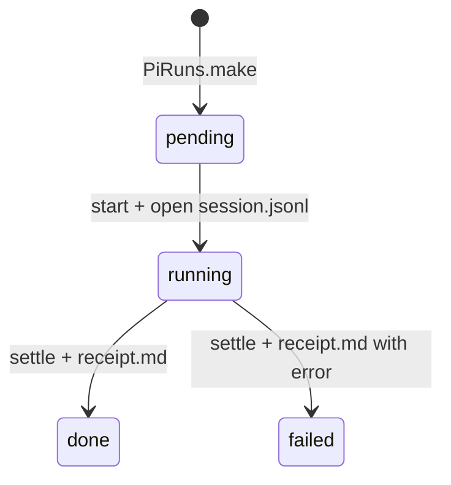

# Session model

Create repo-local runs where the data file is the Pi session.

## Run directory

One run is one Pi session:

```text
runs/2026-09-05-fix-login/
  session.jsonl  # Pi session file — appended live, git-tracked
  run.md         # rendered chat history (derived from session.jsonl)
  receipt.md     # settlement proof on done/failed
  subruns/
    01-scout-auth/session.jsonl
    01-scout-auth/run.md
```

Lifecycle:



## run.md format

```markdown
---
run: 2026-09-05-fix-login
parent: null
status: running
created: 2026-09-05T00:00:00Z
---

# run 2026-09-05-fix-login

## turn 1 — user

Fix login.

## turn 1 — assistant

Scouting auth code.
```

Frontmatter keys:

1. `run` — stable id, matches directory name.
2. `parent` — `null` for main runs, `<run-id>` for subruns.
3. `status` — `pending` / `running` / `done` / `failed`.
4. `created` — ISO timestamp, never changes.

## Subruns

1. Create `subruns/<subrun-id>/` under the parent run with its own `session.jsonl`.
2. Set `parent: <parent-run-id>` in the subrun frontmatter.
3. Append one pointer event to the parent session: `{"subrun-started": "<subrun-id>"}`.
4. Settle subruns before settling the parent — see [pi-subagents lessons](./pi-subagents-lessons.md).

Subrun depth caps at 2 (run → subrun). Deeper nesting becomes a new top-level run.

## session.jsonl

One JSON object per line, appended live by Pi. This file is the session — git-tracked, resumable:

```json
{ "seq": 1, "role": "user", "text": "Fix login.", "at": "2026-09-05T00:00:01Z" }
```

- `run.md` renders from `session.jsonl` — never edit `run.md` by hand.
- Resume reopens `session.jsonl` in `seq` order.

## See also

- [Architecture](./architecture.md) for store location and Pi override.
- [Storage](./storage.md) for git and file-write rules.
- [Pi-subagents lessons](./pi-subagents-lessons.md) for settlement receipts.
- [Index](./index.md) for page map.
