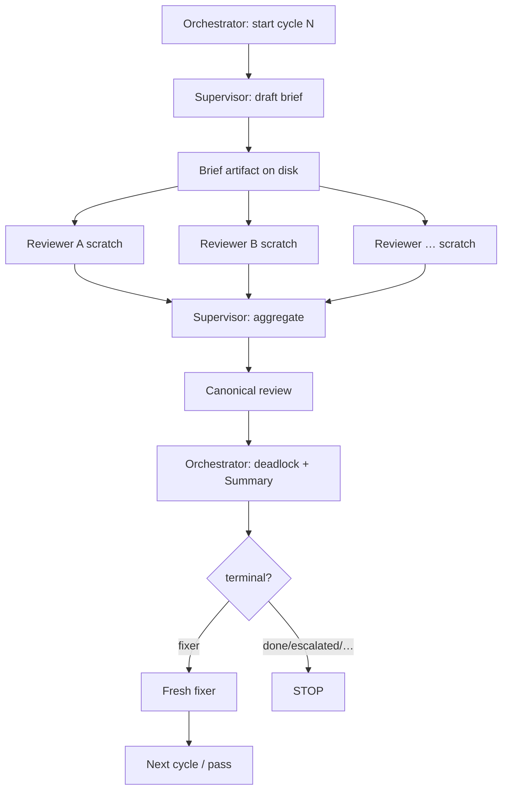

# Design: Pass + Always-On Supervisor

> Status: **implemented**. The review half of every cycle is a supervisor-driven pass: supervisor brief → roster reviewers (scratch) → supervisor aggregate → canonical review. The supervisor is **always on** — there is no mode toggle, no single-reviewer shortcut, and no programmatic merge. Aggregation is always agent-driven.

## Locked decisions

1. **Supervisor is always on.** Every cycle, for every roster size (including the default single `generic` reviewer), the supervisor runs a brief turn and an aggregate turn.
2. **One supervisor session per loop.** Persistent across the loop's cycles; each cycle the orchestrator prompts it (brief, then aggregate) with fresh instructions. Reviewers are **persistent per loop too** — the same sessions re-review the updated code across cycles (with their context); a new loop spawns a fresh independent set (sessions + supervisor disposed and recreated).
3. **Reviewers are read-only on the codebase.** Tools: `read` / `grep` / `glob` (+ `write` for scratch only). Prefer Pi search tools (rg-backed `grep`) with fallbacks; no code-mutating tools.
4. **Supervisor may author/resolve findings** during aggregate — join duplicates, resolve conflicts, fill clear gaps — not only normalize scratch.
5. **Aggregation is never programmatic.** The supervisor owns the canonical file. If the aggregate turn fails (error or empty canonical), the orchestrator retries the pass and escalates after consecutive failures — it never falls back to a code merge.
6. **No reconciliator, no merge module.** The old hybrid programmatic-merge + LLM reconciliator path is removed.

## Motivation

Peer-reviewer scratch reports used to be merged programmatically with an optional LLM reconciliator on conflicts. That model had gaps:

1. **No shared briefing.** Reviewers each invented their own scope from a static `focus` string.
2. **Aggregation was mechanical.** Fingerprint/location merge could not reason about coverage gaps, overlapping severity, or whether reviewers answered the brief.
3. **Mode confusion.** `on-multi` / `always` / `never` toggles made the default path ambiguous and let the loop run without an agent owning the canonical file.

Now a single **supervisor LLM** scopes each pass and aggregates the roster's scratch into one canonical review, every cycle.

The **code orchestrator** remains the loop controller (continue / stop / deadlock / maxLoops). Agents still never decide whether another cycle runs.

---

## Vocabulary

| Term | Meaning |
|---|---|
| **Loop** | One round of review by a **fresh set of independent reviewers**. Counted by `maxLoops` / `loop-state.loop`. On consensus the orchestrator advances to the next loop; at the loop cap the user can add a new loop. |
| **Cycle** | One pass within a loop: *review pass → fixer → next cycle*, re-reviewed by the **same reviewers**. Counted by `maxCycles` / `loop-state.cycle`. Hitting the cycle cap without consensus pauses for a user decision (increase cycles / next loop / stop). |
| **Pass** | The review half of a cycle: supervisor brief → reviewers → supervisor aggregate → canonical review. One pass per cycle. |
| **Orchestrator** | Non-LLM code in `graph.ts`. Owns terminals, deadlines, widget, resume, fixer dispatch. |
| **Supervisor** | LLM agent. Owns *what* to review, *boundaries*, per-reviewer scope packets, and aggregation into one canonical report. |
| **Reviewer** | LLM agent with a skill/objective lens (security, quality, linguist, generic, …). Writes scratch findings only; does not own the canonical file. |
| **Roster** | User-selected set of reviewer ids for this run (built in the TUI wizard from profiles). Decided by the user, not by the supervisor. |
| **Brief** | Supervisor artifact describing target, in-scope / out-of-scope, and per-reviewer instructions for this pass. |
| **Canonical review** | The single report the fixer and humans read (`.agents/reviews/<name>/<code>.md`). |

---

## Roles

### Orchestrator (code) — unchanged authority

Keeps deciding:

- whether a cycle starts / resumes
- when to run fixer vs stop (`done` / `escalated` / `maxLoops` / failures)
- deadlock detection and `[Orchestrator]` Discussion turns
- widget / status / resume via `loop-state.json`

Does **not** invent review scope. After a pass completes, it parses `## Summary` as before.

### Supervisor (LLM) — always on

Responsible for:

1. **Scope.** From target dir / existing review / re-review state, decide what requires attention this pass and what is explicitly out of bounds.
2. **Briefing.** Emit a structured brief the orchestrator hands to each reviewer (global context + that reviewer's slice).
3. **Aggregation.** After reviewers finish, read scratch reports + brief, produce **one** canonical review (dedupe, severity, provenance, coverage notes).

Not responsible for:

- choosing which reviewer *types* are loaded (user/config)
- deciding continue/stop/deadlock
- applying code fixes

### Reviewers (LLM) — fresh every cycle

User-selected. Each profile has:

- `id` / `label`
- `model`
- `skillPath`
- `objective`

They:

- receive the supervisor brief + their scope packet
- write **scratch only** (`passes/<cycle>/scratch/<id>.md`)
- stamp `Source: <id>`
- do **not** overwrite the canonical review
- do **not** decide loop control

### Fixer — unchanged

Still consumes the canonical review only, fresh every cycle. Unaware of passes/supervisor except through Discussion provenance if the supervisor notes sources.

---

## Pass lifecycle (within one cycle)



### Phase 1 — Brief

Supervisor reads:

- target directory / prior canonical review (re-review)
- roster (ids + objectives + skill paths) — **provided by orchestrator, not chosen**
- loop metadata (cycle, open finding ids)

Supervisor writes a brief file at:

```text
.agents/reviews/<name>/<code>/passes/<cycle>/brief.md
```

### Phase 2 — Reviewers

Orchestrator spawns each roster member **fresh**:

- system prompt = reviewer role + objective + skill path
- task = absolute paths to brief, scratch output, target dir
- tools: `read` / `grep` / `glob` (+ `write` for scratch)

Scratch path:

```text
…/passes/<cycle>/scratch/<id>.md
```

### Phase 3 — Aggregate

Supervisor reads brief + all scratch reports (+ existing canonical for terminal preservation) and writes the **canonical** review.

Aggregation duties:

- dedupe overlapping findings; keep highest useful severity
- preserve `Source` / multi-source provenance
- preserve terminal findings from prior canonical unless explicitly reopened by protocol
- note coverage: what was checked, what was skipped (from brief out-of-scope)
- bump `Iteration`, refresh `## Summary`
- append `[Supervisor]` Discussion turns when merging/dropping reviewer items (optional but useful)

Orchestrator then runs deadlock detection and transitions as before.

### Failure handling

- **Brief fails:** retry the pass, counting toward consecutive failures; escalate after the threshold.
- **One reviewer fails:** the orchestrator still aggregates with available scratch (the supervisor notes missing coverage) so the fixer can work on found `Open` items.
- **Aggregate fails:** never fall back to a programmatic merge — retry the pass; escalate after consecutive failures.

---

## Configuration (default)

Equivalent to:

```json
{
  "supervisor": {
    "model": "deepseek-v4-pro",
    "skill": "adversarial-review-supervisor"
  },
  "reviewers": [
    {
      "id": "generic",
      "model": "deepseek-v4-pro",
      "skill": "adversarial-review",
      "objective": "full adversarial audit"
    }
  ],
  "fixer": { "model": "deepseek-v4-flash-free" },
  "maxLoops": 5,
  "deadlock": { "flipThreshold": 2, "action": "escalate" }
}
```

The wizard edits `maxLoops`, `fixer.model`, `supervisor.model`, and `deadlock.flipThreshold` interactively. There is no supervisor-mode or reconcile setting — the supervisor is always on.

---

## On-disk layout (standalone)

```text
.agents/reviews/<name>/
  001.md                      # canonical (fixer + humans)
  001/
    loop-state.json           # + pass metadata (roster, last brief path)
    passes/
      1/
        brief.md              # supervisor → reviewers
        scratch/
          security.md
          quality.md
      2/
        …
```

---

## Session policy

| Role | Session |
|---|---|
| Orchestrator (code) | Resumed via `loop-state.json` |
| Supervisor | **One persistent session per loop** — brief + aggregate prompts each cycle; disposed when the loop ends |
| Reviewers | **Fresh every cycle** |
| Fixer | Fresh every cycle |

---

## Bundled skills

| Path | Role |
|---|---|
| `skills/adversarial-review-supervisor/` | Brief + aggregate protocol |
| `skills/adversarial-review/` | Reviewer finding format (scratch only / obey brief) |
| `skills/addressing-adversarial-review/` | Fixer (unchanged) |

---

## Non-goals

- Supervisor choosing the roster dynamically
- Multiple passes per cycle
- Replacing the code orchestrator with an LLM "meta-supervisor"
- Changing fixer protocol or finding Status machine
- Human-in-the-loop brief approval (nice follow-up)
