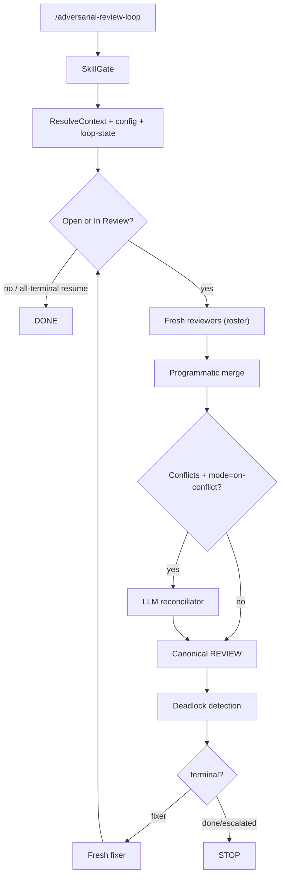

# @montflow/adversarial-review-loop

A Pi extension that runs an automated **adversarial review loop** on your codebase. A **code orchestrator** (not an LLM) drives the cycle: configurable reviewers → (optional supervisor aggregate | hybrid reconciliator) → fixer. Agents write findings/fixes only — they never decide continue/stop/deadlock.

Skills ship **inside this package** under `skills/`. The target project does not need to install them.

In **standalone mode** (default), the review file lives at `.agents/reviews/<name>/<code>.md` with loop state beside it in `.agents/reviews/<name>/<code>/`. In **feature-spec mode** (`--feature-spec --spec-name <name>`), the review file lives inside the review task's directory as `REVIEW.md`.

## Pass + Supervisor

See **[DESIGN-pass-supervisor.md](./DESIGN-pass-supervisor.md)** for the full design.

- **Default:** single `generic` reviewer — **no supervisor** (same as before).
- **Multi-reviewer** (`--reviewers=security,quality,…`): one persistent **supervisor** per loop briefs specialists, then aggregates scratch into the canonical review.
- Specialists are **codebase read-only** (`read` / `grep` / `glob` + `write` for scratch).
- CLI roster flag remains `--reviewers`. Supervisor mode: `--supervisor-mode=on-multi|always|never` (default `on-multi`).

## Bundled skills

| Path | Role |
|---|---|
| `skills/adversarial-review/` | Reviewer behavior + report format |
| `skills/adversarial-review-supervisor/` | Multi-reviewer brief + aggregate |
| `skills/addressing-adversarial-review/` | Fixer triage / fix / Discussion protocol |
| `skills/adversarial-review-reconcile/` | Fallback reconciliator when supervisor is `never` |
| `skills/feature-spec/` | Feature directory layout reference |

Agents spawn with `noSkills: true` and `read` these files by absolute path (`skill-paths.ts`).

## How it works



**Default roster:** a single `generic` reviewer. No LLM reconciliator runs unless there are conflicts (hybrid) — and with one reviewer there are none.

## Configuration

### Default (no flags)

Equivalent to:

```json
{
  "supervisor": {
    "model": "deepseek-v4-pro",
    "mode": "on-multi"
  },
  "reviewers": [
    {
      "id": "generic",
      "model": "deepseek-v4-pro",
      "skill": "adversarial-review",
      "objective": "full adversarial audit"
    }
  ],
  "reconciliator": {
    "model": "deepseek-v4-pro",
    "mode": "on-conflict"
  },
  "fixer": { "model": "deepseek-v4-flash-free" },
  "maxLoops": 5,
  "deadlock": { "flipThreshold": 2, "action": "escalate" }
}
```

### Built-in reviewer ids

`generic` · `security` · `quality` · `technical` (`quality` variant whose objective also covers security — not a true alias) · `guidelines` · `style` · `linguist`

```
/adversarial-review-loop --reviewers=security,quality,linguist
/adversarial-review-loop --config=./review-loop.json
/adversarial-review-loop --reviewer-model=deepseek-v4-pro --fixer-model=deepseek-v4-flash-free
/adversarial-review-loop --supervisor-mode=never
```

Per-agent models come from the config (or builtins). **Models never steer the loop** — the orchestrator parses `## Summary` + `loop-state.json` to decide continue/stop/deadlock.

## Session policy

| Role | Session |
|---|---|
| Orchestrator (code) | Resumed via `loop-state.json` |
| Supervisor | **One persistent session per loop** (multi-reviewer / `always`) |
| Reviewers | **Fresh every cycle** |
| Reconciliator | Fresh per call (only when supervisor is `never`) |
| Fixer | Fresh every cycle |

## On-disk layout (standalone)

```text
.agents/reviews/<name>/
  001.md                 # canonical review (fixer + humans)
  001/
    loop-state.json      # orchestrator memory (resume)
    scratch/<id>.md      # multi-reviewer cycle scratch
```

## Deadlock detection

Programmatic (not LLM):

- Status oscillation (`In Review` → `Open`) past `flipThreshold`
- Suggestion/patch-hash A → B → A at the same fingerprint
- Multiple open findings at the same location with contradictory suggestions

Action: mark finding(s) `Escalated` with an `[Orchestrator]` Discussion turn.

## Widget

Uses Pi `ctx.ui.setWidget` (interactive TUI / RPC). Shows cycle, per-reviewer status, reconcile mode, fixer status, and summary counts. Cleared on terminal. No-op in print/JSON mode.

## Flags

| Flag | Default | Description |
|---|---|---|
| `--reviewer-model` | `deepseek-v4-pro` | Override model for all selected reviewers |
| `--fixer-model` | `deepseek-v4-flash-free` | Fixer model |
| `--depth` / `--max-loops` | `5` | Maximum review cycles |
| `--dir` / `--target-dir` | current dir | Directory to review |
| `--name` | `adversarial` | `<name>` segment of `.agents/reviews/<name>/` |
| `--fresh` | `false` | Allocate a new `<code>` instead of reusing |
| `--reviewers` | `generic` | Comma-separated builtin reviewer ids |
| `--supervisor-model` | reviewer default | Supervisor model override |
| `--supervisor-mode` | `on-multi` | `on-multi` \| `always` \| `never` |
| `--config` | _(none)_ | JSON config file path |
| `--feature-spec` | `false` | Enable feature-spec mode |
| `--spec-name` | _(optional)_ | Feature name under `.agents/features/` |

## Installation

```json
{
  "pi": {
    "extensions": ["path/to/adversarial-review-loop/index.ts"]
  }
}
```

Requires `@earendil-works/pi-coding-agent` as a peer dependency. TypeScript loaded by Pi's jiti loader — no build step. Runtime side effects use Effect v4 + `@effect/platform-node`.

## Module map

| File | Responsibility |
|---|---|
| `index.ts` | Pi command entry + flag parsing |
| `config.ts` | Default/builtin roster + config resolve |
| `graph.ts` | State machine (orchestrator) |
| `loop-state.ts` | Resumable orchestrator memory |
| `merge.ts` | Programmatic multi-reviewer merge |
| `deadlock.ts` | Oscillation / thrash detection |
| `widget.ts` | Pi `setWidget` rendering |
| `findings.ts` | Finding parse/render helpers |
| `agents.ts` | Per-role system prompts + tools |
| `runner.ts` | Fresh agent sessions |
| `skills/` | Bundled role skills |
| `test/` | Unit tests |
