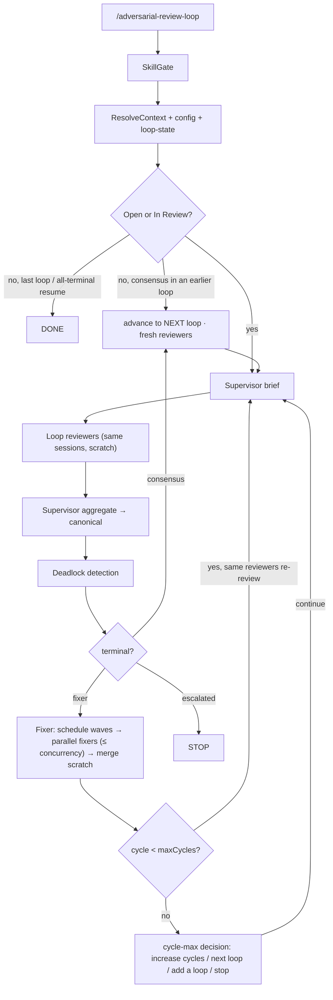

# @montflow/adversarial-review-loop

A Pi extension that runs an automated **adversarial review loop** on your codebase. A **code orchestrator** (not an LLM) drives the **loops and cycles**: each **loop** spawns a fresh set of independent reviewers; within a loop the **same reviewers re-review the updated code** (with their context) across cycles until they reach consensus or hit the per-loop cycle cap. Agents write findings/fixes only — they never decide continue/stop/deadlock.

Skills ship **inside this package** under `skills/`. The target project does not need to install them.

The review file lives at `.agents/reviews/<name>/<code>.md` with loop state beside it in `.agents/reviews/<name>/<code>/`.

> **Interactive-only** — this extension is no longer a CLI. `/adversarial-review-loop` always opens the TUI wizard below; there are no flags to pass.

## Loops & cycles

A **cycle** is one review pass of a loop: supervisor brief → the loop's reviewers review → supervisor aggregate → canonical review → deadlock check → fixers fix the open findings. Then the orchestrator goes **back to the same reviewers** with the updated code and they re-review (with their session context) — that resumes the cycle.

- When a cycle ends with **no actionable findings** (all resolved / won't fix — **consensus**), the loop is complete and the orchestrator advances to the **next loop**, spawning a **fresh set of independent reviewers** (no context from the previous loop).
- When a loop hits its **cycle max** without consensus, the loop pauses and asks the user: **Increase cycle max** (keep the same reviewers grinding), **Resume to NEXT loop** (fresh reviewers), or **Stop**. At the last loop the same prompt offers **Add a new loop** instead (extends `maxLoops` and continues), otherwise the run just ends.

## Interactive wizard

Running `/adversarial-review-loop` (in the TUI) opens an interactive setup wizard:

1. **Action menu** — **New review**, **Resume review**, or **Preset** to manage stored
   configurations (create / list / modify / delete). **New review requires a stored preset**
   (hidden when none exist); **Resume review** continues an interrupted loop from an existing
   review (hidden when none exist). Pick a preset, then pick the scope, and the loop runs
   with the preset's configuration (roster + settings always come from the preset).
2. **Scope** (after picking a preset) — three options:
   - **Git unstaged changes** (tracked + untracked; the diff is materialized next to the review file so reviewers read exactly what changed).
   - **Pick…** — type space-separated files/directories with **file autocomplete** (path/directory suggestions appear as you type; Tab or Enter applies a suggestion), a free-form focus prompt, or `.` for the whole directory. Paths that exist become the file scope; any other text becomes the focus prompt.
   - **Directive…** — a free-form prompt for the supervisor: describe *what* you want reviewed ("only the file-signing flow in `src/crypto/`", "check the import feature") and the supervisor treats it as the authoritative intent for the pass — it locates the relevant code itself (read/grep/glob) and scopes the specialists to it, instead of you naming files.
3. **Reviewer roster** (inside **Create / Modify preset**) — starts with a single built-in `generic` reviewer (no profile needed). `+ Add reviewer` lists the **profiles stored in the current repo** (`.agents/profiles/`, via the `@montflow/profiles` extension) with their descriptions — type to search. Each added reviewer gets a **model** pick from a searchable list of **every model available in the session**, **preselected with the model you are currently using** (the profile's preferred model stays reachable via search). The same picker backs "Change model of a reviewer", "Fallback models of a reviewer", and the fixer/supervisor model settings. Change/remove reviewers freely.
4. **Settings** (inside **Create / Modify preset**) — edit **max loops** (how many independent reviewer sets run), **max cycles per loop** (how many times the same reviewers re-review), **fixer model**, **supervisor model**, **fallback model chains**, and **deadlock flip threshold**. The supervisor itself is always on.
5. **Run** — the chosen preset + confirmed scope become the loop options and the loop starts immediately.

Every menu offers a **`← Back`** option that steps up to the previous menu (scope → action
menu; in preset operations, back returns to the preset submenu, and the preset submenu's back
returns to the action menu). `Esc` still cancels the whole setup.

### Retries & fallback models

Every agent turn (reviewers, supervisor, fixers) runs through a retry/fallback policy so
rate limits and temporary provider failures don't kill the loop:

- **Transient failures are retried** on the same model with exponential backoff (2 retries,
  2s → 4s by default). Rate limits (`429` / quota / throttling), provider overloads (`5xx`,
  `529`), and network blips (`ECONNRESET`, timeouts) are classified as transient; auth,
  bad-request, and unknown-model errors are permanent and are **not** retried. Timed-out
  turns are never retried in place (the session may still be busy) — the session is
  disposed instead.
- **Fallback model chains** — every role (each reviewer, the supervisor, the fixer) can have
  an ordered list of fallback models (`fallbackModels` / `fixerFallbackModels` in the
  preset). When the primary model exhausts its retries (or fails permanently), the next
  model in the chain is tried: the session is recreated with it (reviewers/supervisor) or
  the single-use run is re-dispatched (fixers). When EVERY model fails, the failure is
  reported with a per-model breakdown (`All 2 model(s) failed: …`) instead of a bare
  "agent failed".
- Configure chains in the wizard (**Settings → fixer/supervisor fallback models**, roster →
  **Fallback models of a reviewer**) or directly in the preset JSON. Empty chains mean no
  fallback — the primary model is the only one tried.

**An agent must complete before the loop moves on.** A failed turn is never silently
skipped:

- **Reviewers** are retried **in-pass** (fresh session, next fallback model, up to 3
  attempts). The supervisor aggregate only runs after EVERY reviewer completed — a missing
  reviewer's lens would silently drop findings. A reviewer that still fails after its
  in-pass attempts fails the pass (retry, then escalate to a human after 2 consecutive
  failed passes).
- **Fixers** are **re-dispatched** in-phase (each re-dispatch gets the prior failure record
  + partial scratch as hand-off context, up to 3 attempts). A finding that still produced
  no valid block after every attempt **escalates to a human** — the phase never advances
  with a failed finding. Escalated runs are resumable: the review keeps its state, and a
  resume re-enters the fixer phase to re-dispatch the failed findings.

### Resuming an interrupted loop

Interrupted loops are resumable: the review file (`.agents/reviews/adversarial/<code>.md`)
and its loop state (`.agents/reviews/adversarial/<code>/loop-state.json`) are the persisted
orchestrator memory, so the findings' Status/Attempts/Discussion threads and the deadlock
tracker all survive a stop. From the action menu, **Resume review**:

1. Picks the review to resume (searchable list annotated with its reviewer ids, loop/cycle,
   and summary counts).
2. Asks whether to resume with the **locked-in config** or **modify config before
   resuming** — re-edit the reviewer roster and settings (models, **fallback model
   chains**, loops/cycles, deadlock) seeded from the review's snapshot, then write the
   updated config back into `loop-state.json`. Later resumes keep using the modified
   snapshot. Use this to add fallback models to a review that kept hitting rate limits.
3. Re-runs **in place** (`fresh: false` targeting that file): the reviewers re-review the
   existing findings (Step 9), the fixer continues the remaining `Open` findings, and the
   loop/cycle counters continue from loop-state (e.g. an interrupted loop 1 cycle 3 resumes
   at loop 1 cycle 4/5). Sessions are recreated on resume (persistent context is best-effort
   within a continuous run).

**Resume routing is phase-aware.** The orchestrator records the last completed phase
(`reviewed` / `fixed`) in `loop-state.json`. A resume after the review phase completed jumps
**straight into the fixer phase** — the reviewers do not re-run (their verdicts are already
in the canonical file). The fixer phase is checkpointed per finding:

- A fixer's scratch block (`passes/<loop>/<cycle>/fixes/<F>.md`) **is the checkpoint**: if a
  previous fixer finished writing its updated block but the run died before the merge, the
  resume merges it automatically without re-dispatching.
- A failed fixer attempt writes its **failure reason** to `fixes/<F>.error.json` (session
  error / agent error / timeout / missing, malformed, or wrong-id scratch). The re-dispatched
  fixer gets that reason plus any partial scratch as **hand-off context**, so it can finish
  or correct the previous attempt's work instead of re-applying changes blindly.

The configuration is **locked in**: every loop writes its resolved config (reviewers,
models, supervisor, fixer, max loops, max cycles, deadlock) into `loop-state.json` at
start, and resume uses exactly that snapshot — **no preset pick, and editing a preset later
never changes what a running/stopped review resumes with**. Cycle-max decisions that raise
the cycle cap or add a loop persist into that snapshot too. Legacy reviews created before
config snapshots fall back to picking a preset once (which then becomes their snapshot);
legacy snapshots/presets without `maxCycles` are migrated (their old `maxLoops` becomes the
per-loop cycle cap with the default loop count).

A resume of a fully-resolved review at its **last** loop exits early with
"already all-terminal — nothing to do"; if earlier loops remain, it advances to the next
loop's fresh reviewers instead.

### Stopping the loop

The loop is **gracefully stoppable**: the graph checks an abort signal between steps
(nodes/cycles, between reviewers, between fixer findings) and terminates cleanly —
disposing the supervisor and per-loop reviewer sessions, clearing the widget, and
notifying. An in-flight agent
turn finishes first (or hits its timeout); the loop stops before the next one starts. Stop
anytime and **Resume review** continues where it left off.

- **`/adversarial-review-loop-stop`** — the explicit stop command.
- **`Ctrl+C` / `Esc`** in the TUI while the loop runs also fire the stop (when the TUI
  routes the key to the extension).
- For an **immediate kill**, `Ctrl+C` twice at the terminal level terminates the pi process
  (and with it the running agents) — use this only when a graceful stop isn't enough.

### Inspect an agent (live stream)

While the loop runs you can drill into any agent's **live token stream** (visible text and
thinking deltas) — **`Ctrl+Shift+F`**, one keypress while the loop runs:

- **`Ctrl+Shift+F`** (in the TUI) — opens the interactive agent picker: lists the agents
  that have produced output so far (supervisor, each reviewer, each fixer) to pick from.
- **`/adversarial-review-loop-focus`** (no arg) — the same picker as a command.
- **`/adversarial-review-loop-focus <agent>`** — inspects the widget directly, e.g.
  `/adversarial-review-loop-focus reviewer:security` or `/adversarial-review-loop-focus supervisor`.
- **`/adversarial-review-loop-focus off`** — returns the widget to the roster view.

The focused widget keeps the header (loop/cycle/phase/elapsed) and the live `now` tool
line, and shows the agent's stream tail (text, falling back to thinking when only
reasoning has streamed). The stream store is capped (keeps the tail) so long briefs and
aggregates can't grow without bound.

### Inspect issues (findings table)

While the loop runs you can open an interactive **findings table** — the full picture of
what the reviewers found and where each finding stands:

- **`Ctrl+Shift+I`** (in the TUI) — opens the browser. No command needed — one keypress
  while the loop runs.
- **`/adversarial-review-loop-findings`** — the same browser as a command.

The browser shows every finding in the canonical review file as a table row:
`F5 · Major · <title>` with a secondary line carrying `status · attempts · fixer
<status> <live tool> · location`. Rows sort **running fixers first** (what's happening
now), then by severity. `type` filters, `↑↓` navigates, and the bottom pane shows the
selected finding's detail: status/attempts, the corresponding fixer (status + current
tool + model chain), location, source, Problem/Impact/Suggestion, and the discussion
thread tail. The detail re-reads the review file on every navigation step, so merges that
happen while the browser is open appear live.

```
/adversarial-review-loop                  # interactive wizard (TUI only)
```

## Presets

**Presets** persist the loop *configuration* (reviewer roster + supervisor + settings) so a
review setup can be reused. They are stored as JSON files in the project at
`.agents/review-presets/<name>.json` (sibling of `.agents/profiles/` and `.agents/reviews/`).

From the action menu, **Preset** opens a submenu:

| Action | Behavior |
|---|---|
| **Create preset** | Like **New review** but **skips the scope pick** — only name, roster, and settings. The settings confirm reads **✓ Done — create preset** (not "start review"). The configuration is written to `.agents/review-presets/<name>.json`; afterwards the wizard logs a summary of the saved config and asks **Continue / Exit**. Refuses to overwrite an existing name (use Modify). |
| **List presets** | Pick a stored preset (searchable list, annotated with its reviewer/loops/fixer summary) and view its configuration as a **boxed ASCII graphic** (reviewers, supervisor, fixer, max loops, max cycles/loop, deadlock). While viewing, act directly on it: **Modify** (re-edit, then re-renders the updated graphic) or **Delete** (confirm, removes the file). |
| **Modify preset** | Pick a stored preset, re-edit its roster + settings seeded from the stored config (settings confirm reads **✓ Done — update preset**), and write the result back under the same name. |
| **Delete preset** | Pick a stored preset, confirm, and remove its file. |

Running a review always happens through **New review** (action menu), which picks a stored
preset and then the scope. Each preset operation returns to the preset submenu; **`← Back`**
returns to the action menu, and `Esc` cancels the whole setup. When no presets are stored
yet, **List / Modify / Delete are hidden** — the submenu shows only **Create preset** and
**`← Back`**, and the action menu shows only **Preset** (no **New review**).

### Preset file format (Effect Schema)

Preset files are validated by the Effect Schema in `preset-schema.ts`
(`ReviewPresetSchema` / `ReviewPresetFromJson`):

```json
{
  "version": 1,
  "name": "security-audit",
  "config": {
    "reviewers": [
      { "type": "builtin", "id": "generic" },
      { "type": "profile", "name": "security-auditor", "model": "anthropic/claude-sonnet-4-5" }
    ],
    "supervisor": { "model": "deepseek-v4-pro" },
    "fixerModel": "deepseek-v4-flash-free",
    "maxLoops": 3,
    "maxCycles": 5,
    "agentConcurrency": 5,
    "deadlock": { "flipThreshold": 2, "action": "escalate" }
  }
}
```

Reviewers are stored as **references**, not expanded profiles:

- `{ "type": "builtin", "id": "generic" }` — a builtin reviewer from the catalog.
  The `model` field is omitted when it equals the builtin's default.
- `{ "type": "profile", "name": "security-auditor", "model": "…" }` — a profile
  from `.agents/profiles/`, with the model chosen when it was added.

The objective text, label, and bundled skill paths are **never stored** — they are
resolved at **Use / Modify** time (`preset-resolve.ts`) from the builtin catalog or the
profile itself, so a preset stays small, portable, and never goes stale when a profile
changes. Resolving a profile reference requires the `@montflow/profiles` extension (same
as building a roster from profiles). The schema rejects unknown versions, missing fields,
unknown reviewer `type`, and unknown `deadlock.action` values, and the store
(`preset-store.ts`) validates the preset name to block path traversal.

## Reviewers are profiles

This extension **requires the `@montflow/profiles` extension** whenever the roster is built from profiles (interactive mode, or a profile reviewer id that is not a builtin). Profiles live at `.agents/profiles/<name>/PROFILE.md` and are read over Pi's shared event bus (`profiles:get` / `profiles:list`) — no code coupling between the two extensions.

The profile contributes the reviewer's **id/label**, **preferred model**, and its **description / instructions / review checklist become the reviewer's objective lens**. The bundled `adversarial-review` skill is always the behavioral skill.

The only roster entry that does **not** require profiles is the built-in `generic` reviewer (the default). The other builtin ids (`security`, `quality`, …) remain available through the wizard's profile list only if a profile of that name exists — add builtins to a roster by creating matching profiles.

### Install the profiles extension

```bash
mkdir -p .pi/extensions
ln -s <pi>/pi/profiles .pi/extensions/profiles
# or globally: ln -s <pi>/pi/profiles ~/.pi/agent/extensions/profiles
```

Then `/reload`. When profiles is missing and you try to add a profile reviewer (or resolve a profile id in the roster), you get a clear install hint instead of a silent failure.

## Pass + Supervisor

See **[DESIGN-pass-supervisor.md](./DESIGN-pass-supervisor.md)** for the full design.

- **The supervisor is always on** — there is no mode toggle. Every cycle: supervisor brief → the loop's reviewers → supervisor aggregate → canonical review.
- **Reviewers persist per loop** — the same sessions re-review the updated code across a loop's cycles (with their context); a new loop spawns a fresh independent set (new sessions, supervisor disposed).
- **Aggregation is always agent-driven** — the supervisor owns the canonical file; a failed aggregate retries the pass rather than falling back to a programmatic merge.
- Reviewers are **codebase read-only** (`read` / `grep` / `glob` + `write` for scratch).
- Supervisor mode and reconcile settings are gone (no `on-multi`/`always`/`never`, no reconciliator).

## Bundled skills

| Path | Role |
|---|---|
| `skills/adversarial-review/` | Reviewer behavior + report format |
| `skills/adversarial-review-supervisor/` | Brief + aggregate (always-on) |
| `skills/addressing-adversarial-review/` | Fixer triage / fix / Discussion protocol |

Agents spawn with `noSkills: true` and `read` these files by absolute path (`skill-paths.ts`).

## How it works



**Default roster:** a single `generic` reviewer behind the always-on supervisor. The supervisor briefs it, the reviewer writes scratch, the supervisor aggregates into the canonical review.

## Configuration

### Defaults (editable in the wizard's Settings step)

Equivalent to:

```json
{
  "supervisor": {
    "model": "deepseek-v4-pro",
    "skill": "adversarial-review-supervisor"
  },
  "reviewers": [
    {
      "id": "generic",
      "model": "deepseek-v4-pro",
      "skill": "adversarial-review",
      "objective": "full adversarial audit"
    }
  ],
  "fixer": { "model": "deepseek-v4-flash-free" },
  "maxLoops": 3,
  "maxCycles": 5,
  "deadlock": { "flipThreshold": 2, "action": "escalate" }
}
```

The wizard edits `maxLoops`, `maxCycles`, `fixer.model`, `supervisor.model`,
`deadlock.flipThreshold`, and `agentConcurrency` interactively. Presets persist this
configuration in the **runtime shape** (`fixerModel` / `skillPath` — see [Preset file
format](#preset-file-format-effect-schema)). `agentConcurrency` defaults to **5** and caps
how many reviewer/fixer agents run in parallel (reviewer fan-out and fixer waves; 1 =
fully sequential); legacy presets without it default to 5.

### Built-in reviewer ids

`generic` · `security` · `quality` · `technical` (`quality` variant whose objective also covers security — not a true alias) · `guidelines` · `style` · `linguist`

Builtin ids are used to seed the **default `generic` roster entry** and are referenced by the profiles extension (`PROFILE.md` skills) rather than through CLI flags. Reviewer rosters are built in the wizard from stored profiles.

## Session policy

| Role | Session |
|---|---|
| Orchestrator (code) | Resumed via `loop-state.json` |
| Supervisor | **One persistent session per loop** (brief + aggregate); disposed and recreated per loop |
| Reviewers | **One persistent session per reviewer per loop** — the same reviewers re-review the updated code across the loop's cycles **with their context**. A new loop spawns a fresh independent set (new sessions, no prior context). Each reviewer is codebase read-only, writes only its own scratch file; they run **in parallel**, capped by `agentConcurrency` (default 5). A timed-out/errored session is disposed and recreated on retry |
| Fixer | **Fresh per finding** — scheduled in **waves**: same-location (related) findings run sequentially, different locations run in parallel, capped by `agentConcurrency` (default 5). Each fixer writes its updated finding block to a per-finding scratch file; the orchestrator merges them into the review file after each wave (agents never race on the shared file). 5-minute budget per finding |

Sessions are in-memory: stopping and resuming recreates them (context continuity is
best-effort within a continuous run — the canonical review file remains the source of
truth).

## On-disk layout (standalone)

```text
.agents/reviews/<name>/
  001.md                 # canonical review (fixer + humans)
  001/
    loop-state.json      # orchestrator memory (resume): loop + cycle counters
    scope.diff           # materialized git unstaged diff (git-unstaged scope)
    passes/
      1/                 # loop 1
        1/               #   cycle 1
          brief.md       #     supervisor → reviewers
          scratch/<id>.md#     per-reviewer cycle scratch
          fixes/<id>.md  #     per-finding fixer blocks (merged after each wave)
      2/                 # loop 2 (fresh reviewers, new pass dirs)
```

## Deadlock detection

Programmatic (not LLM):

- Status oscillation (`In Review` → `Open`) past `flipThreshold`
- Suggestion/patch-hash A → B → A at the same fingerprint
- Multiple open findings at the same location with contradictory suggestions

Action: mark finding(s) `Escalated` with an `[Orchestrator]` Discussion turn.

## Widget

Uses Pi `ctx.ui.setWidget` (interactive TUI / RPC). Renders a colored, summary-first
status board above the editor: **loop/cycle progress** (`loop 1/3 · cycle 2/5`) + current
phase with a **spinner and a live elapsed timer**, loop-level banners for **consensus**
(✓ loop complete — fresh reviewers next) and the **cycle-max decision** (waiting on you),
the findings scoreboard (open / in-review / resolved / escalated, with a deadlock warning),
supervisor status, per-reviewer status (queued / reviewing / done, with finding counts, all
running concurrently with a `N concurrent` tag), fixer status with **concurrency and wave
progress** (`3 concurrent · wave 2/3 · fixed 6/9`), and a live `now` line showing the
current tool of the running agent. Statuses use human-readable labels (e.g. `waiting on
reviewers`, `reviewing`) and are colored via the current theme. The scoreboard is kept at
the top so it survives Pi's widget line limit with large rosters. Agent progress is driven
through Pi's UI APIs only — the extension writes nothing to stdout, so it never corrupts
the TUI layout. Cleared on terminal. No-op in print/JSON mode.

While a loop runs, `/adversarial-review-loop-focus` (or **`Ctrl+Shift+F`**) swaps the
roster for one agent's **live stream** (see [Watching a running agent's stream](#watching-a-running-agents-stream)):
the header + `now` tool line stay, and the stream tail (text, or thinking when only
reasoning has streamed) renders below, refreshed by the widget's 1s timer from a shared
mutable stream store — no per-token widget pushes.

During the **fixer phase** the widget adds a **wave schedule diagram** and **per-fixer
rows** so the many parallel fixers are visible, not just the aggregate counter: each
fixer gets a row (finding id + `◉`/`○`/`●`/`✗` glyph + its current live tool), and the
schedule shows the waves (`✓[F1 F2] ▶[F3] [F4 F5]` — done waves checked, the current
wave highlighted, later waves plain). Done rows collapse into the `fixed N/M` counter;
rows are capped (`+N more`). A dim `hint` line advertises the focus shortcut.

## herdr visibility

When pi runs inside a **herdr** pane, herdr normally only sees the main session's
`Working...` indicator — the loop's agents run in background sessions while the main
session is idle, so the pane would show as idle mid-loop. The extension speaks herdr's
`pane.report_agent` socket protocol directly (the same one herdr's own pi integration
uses): it reports `working` when the loop starts — refreshed by a 30s heartbeat carrying
the current phase (`[loop 1/3 · cycle 1/5] supervisor brief`) — and `idle` when the loop
ends (done, failed, or stopped). Requires `HERDR_ENV=1` + `HERDR_SOCKET_PATH` +
`HERDR_PANE_ID` (set automatically in herdr panes); a no-op elsewhere, and a failed send
never blocks or fails the loop.

## Installation

```json
{
  "pi": {
    "extensions": ["path/to/adversarial-review-loop/index.ts"]
  }
}
```

Requires `@earendil-works/pi-coding-agent` as a peer dependency. TypeScript loaded by Pi's jiti loader — no build step. Runtime side effects use Effect v4 + `@effect/platform-node`.

## Module map

| File | Responsibility |
|---|---|
| `index.ts` | Pi command entry — always opens the interactive wizard (no CLI flags) |
| `interactive.ts` | Interactive setup wizard (action menu + scope picker + roster builder + settings editor) |
| `profiles-client.ts` | `@montflow/profiles` event-bus client + profile→reviewer mapping |
| `models-client.ts` | Model-picker helpers (available models, current-model preselection) |
| `config.ts` | Defaults, builtin reviewer catalog, roster helpers |
| `preset-schema.ts` | Effect Schema for the JSON preset configuration (reviewer references) |
| `preset-resolve.ts` | Resolves stored reviewer references (builtin catalog / profiles bus) into the runtime config |
| `preset-store.ts` | `.agents/review-presets/` CRUD (list / read / write / delete + name validation) |
| `graph.ts` | State machine (orchestrator) |
| `loop-state.ts` | Resumable orchestrator memory |
| `deadlock.ts` | Oscillation / thrash detection |
| `widget.ts` | Pi `setWidget` rendering |
| `findings.ts` | Finding parse/render helpers |
| `agents.ts` | Per-role system prompts + tools |
| `runner.ts` | Fresh + persistent agent sessions |
| `stream.ts` | Live per-agent token stream store (focus command + widget) |
| `herdr.ts` | herdr pane agent-state reporting (working/idle while the loop runs) |
| `git.ts` | Git branch + working-tree diff helpers |
| `skills/` | Bundled role skills |
| `test/` | Unit tests |
