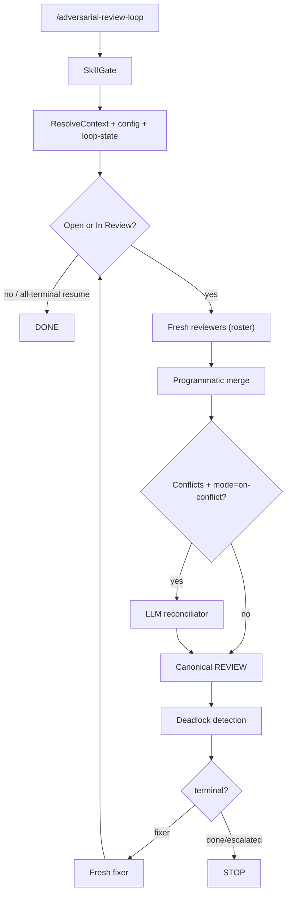

# @montflow/adversarial-review-loop

A Pi extension that runs an automated **adversarial review loop** on your codebase. A **code orchestrator** (not an LLM) drives the cycle: configurable reviewers → (optional supervisor aggregate | hybrid reconciliator) → fixer. Agents write findings/fixes only — they never decide continue/stop/deadlock.

Skills ship **inside this package** under `skills/`. The target project does not need to install them.

In **standalone mode** (default), the review file lives at `.agents/reviews/<name>/<code>.md` with loop state beside it in `.agents/reviews/<name>/<code>/`. Feature-spec mode (review file as `REVIEW.md` inside a feature's review task) exists in the graph but is **not reachable from the interactive wizard yet** — wire it into the action menu to re-enable.

> **Interactive-only** — this extension is no longer a CLI. `/adversarial-review-loop` always opens the TUI wizard below; there are no flags to pass.

## Interactive wizard

Running `/adversarial-review-loop` (in the TUI) opens an interactive setup wizard:

1. **Action menu** — currently **New review** (resume / history entries plug in later).
2. **Scope** — two options:
   - **Git unstaged changes** (tracked + untracked; the diff is materialized next to the review file so reviewers read exactly what changed).
   - **Pick…** — type space-separated files/directories, a free-form focus prompt, or `.` for the whole directory. Paths that exist become the file scope; any other text becomes the focus prompt.
3. **Reviewer roster** — starts with a single built-in `generic` reviewer (no profile needed). `+ Add reviewer` lists the **profiles stored in the current repo** (`.agents/profiles/`, via the `@montflow/profiles` extension) with their descriptions — type to search. Each added reviewer gets a **model** pick (prefilled with the profile's preferred model). Change/remove reviewers freely.
4. **Settings** — edit **max loops**, **fixer model**, **supervisor mode/model**, **reconcile mode**, and **deadlock flip threshold** before running.
5. **Run** — the confirmed scope + roster + settings become the loop options and the loop starts immediately.

```
/adversarial-review-loop                  # interactive wizard (TUI only)
```

## Reviewers are profiles

This extension **requires the `@montflow/profiles` extension** whenever the roster is built from profiles (interactive mode, or a profile reviewer id that is not a builtin). Profiles live at `.agents/profiles/<name>/PROFILE.md` and are read over Pi's shared event bus (`profiles:get` / `profiles:list`) — no code coupling between the two extensions.

The profile contributes the reviewer's **id/label**, **preferred model**, and its **description / instructions / review checklist become the reviewer's objective lens**. The bundled `adversarial-review` skill is always the behavioral skill.

The only roster entry that does **not** require profiles is the built-in `generic` reviewer (the default). The other builtin ids (`security`, `quality`, …) remain available through the wizard's profile list only if a profile of that name exists — add builtins to a roster by creating matching profiles.

### Install the profiles extension

```bash
mkdir -p .pi/extensions
ln -s <pi>/pi/profiles .pi/extensions/profiles
# or globally: ln -s <pi>/pi/profiles ~/.pi/agent/extensions/profiles
```

Then `/reload`. When profiles is missing and you try to add a profile reviewer (or resolve a profile id in the roster), you get a clear install hint instead of a silent failure.

## Pass + Supervisor

See **[DESIGN-pass-supervisor.md](./DESIGN-pass-supervisor.md)** for the full design.

- **Default:** single `generic` reviewer — **no supervisor** (same as before).
- **Multi-reviewer** (add profiles in the wizard): one persistent **supervisor** per loop briefs specialists, then aggregates scratch into the canonical review.
- Specialists are **codebase read-only** (`read` / `grep` / `glob` + `write` for scratch).
- Supervisor mode (`on-multi` default) is editable in the wizard's **Settings** step.

## Bundled skills

| Path | Role |
|---|---|
| `skills/adversarial-review/` | Reviewer behavior + report format |
| `skills/adversarial-review-supervisor/` | Multi-reviewer brief + aggregate |
| `skills/addressing-adversarial-review/` | Fixer triage / fix / Discussion protocol |
| `skills/adversarial-review-reconcile/` | Fallback reconciliator when supervisor is `never` |
| `skills/feature-spec/` | Feature directory layout reference |

Agents spawn with `noSkills: true` and `read` these files by absolute path (`skill-paths.ts`).

## How it works



**Default roster:** a single `generic` reviewer. No LLM reconciliator runs unless there are conflicts (hybrid) — and with one reviewer there are none.

## Configuration

### Defaults (editable in the wizard's Settings step)

Equivalent to:

```json
{
  "supervisor": {
    "model": "deepseek-v4-pro",
    "mode": "on-multi"
  },
  "reviewers": [
    {
      "id": "generic",
      "model": "deepseek-v4-pro",
      "skill": "adversarial-review",
      "objective": "full adversarial audit"
    }
  ],
  "reconciliator": {
    "model": "deepseek-v4-pro",
    "mode": "on-conflict"
  },
  "fixer": { "model": "deepseek-v4-flash-free" },
  "maxLoops": 5,
  "deadlock": { "flipThreshold": 2, "action": "escalate" }
}
```

The wizard edits `maxLoops`, `fixer.model`, `supervisor.mode` + `model`, `reconciliator.mode`, and `deadlock.flipThreshold` interactively.

### Built-in reviewer ids

`generic` · `security` · `quality` · `technical` (`quality` variant whose objective also covers security — not a true alias) · `guidelines` · `style` · `linguist`

Builtin ids are used to seed the **default `generic` roster entry** and are referenced by the profiles extension (`PROFILE.md` skills) rather than through CLI flags. Reviewer rosters are built in the wizard from stored profiles.

## Session policy

| Role | Session |
|---|---|
| Orchestrator (code) | Resumed via `loop-state.json` |
| Supervisor | **One persistent session per loop** (multi-reviewer / `always`) |
| Reviewers | **Fresh every cycle** |
| Reconciliator | Fresh per call (only when supervisor is `never`) |
| Fixer | Fresh every cycle |

## On-disk layout (standalone)

```text
.agents/reviews/<name>/
  001.md                 # canonical review (fixer + humans)
  001/
    loop-state.json      # orchestrator memory (resume)
    scope.diff           # materialized git unstaged diff (git-unstaged scope)
    scratch/<id>.md      # multi-reviewer cycle scratch
```

## Deadlock detection

Programmatic (not LLM):

- Status oscillation (`In Review` → `Open`) past `flipThreshold`
- Suggestion/patch-hash A → B → A at the same fingerprint
- Multiple open findings at the same location with contradictory suggestions

Action: mark finding(s) `Escalated` with an `[Orchestrator]` Discussion turn.

## Widget

Uses Pi `ctx.ui.setWidget` (interactive TUI / RPC). Shows cycle, per-reviewer status, reconcile mode, fixer status, and summary counts. Cleared on terminal. No-op in print/JSON mode.

## Installation

```json
{
  "pi": {
    "extensions": ["path/to/adversarial-review-loop/index.ts"]
  }
}
```

Requires `@earendil-works/pi-coding-agent` as a peer dependency. TypeScript loaded by Pi's jiti loader — no build step. Runtime side effects use Effect v4 + `@effect/platform-node`.

## Module map

| File | Responsibility |
|---|---|
| `index.ts` | Pi command entry — always opens the interactive wizard (no CLI flags) |
| `interactive.ts` | Interactive setup wizard (action menu + scope picker + roster builder + settings editor) |
| `profiles-client.ts` | `@montflow/profiles` event-bus client + profile→reviewer mapping |
| `config.ts` | Defaults, builtin reviewer catalog, roster helpers |
| `graph.ts` | State machine (orchestrator) |
| `loop-state.ts` | Resumable orchestrator memory |
| `merge.ts` | Programmatic multi-reviewer merge |
| `deadlock.ts` | Oscillation / thrash detection |
| `widget.ts` | Pi `setWidget` rendering |
| `findings.ts` | Finding parse/render helpers |
| `agents.ts` | Per-role system prompts + tools |
| `runner.ts` | Fresh agent sessions |
| `git.ts` | Git branch + working-tree diff helpers |
| `skills/` | Bundled role skills |
| `test/` | Unit tests |
