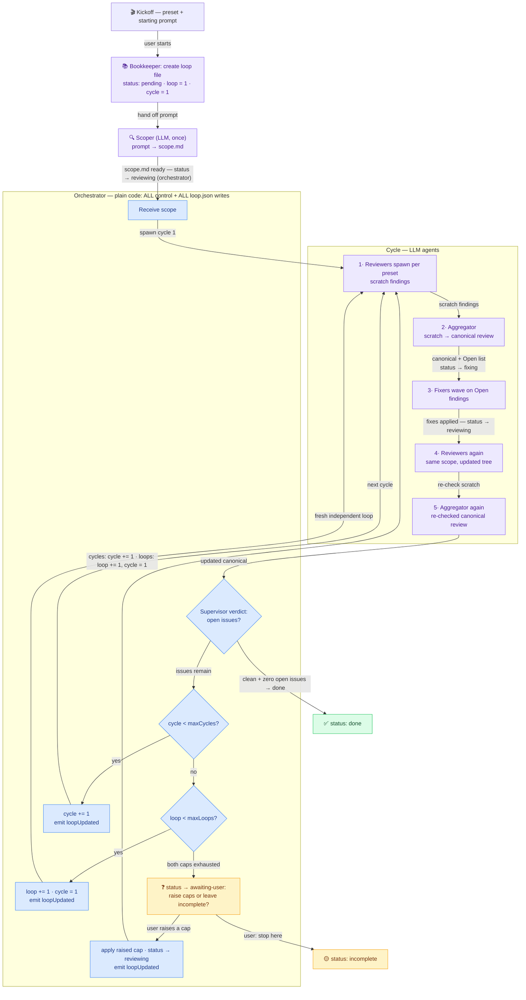

# Loop execution — scoper, orchestrator, supervisor

> **Next action:** read §3 (the full flow with the new Scoper step) and §5
> (loop file + statuses). Both define new behavior needing your sign-off.
> ~8 min read.

Companion to [preset.md](preset.md) (the config). This page plans the
**runtime**: what happens between "user types a prompt + picks a preset" and
a finished review loop.

Planning only — no code yet.

---

## 1. The cast

| Actor | What it is | Decides |
|---|---|---|
| **Kickoff prompt** | Free text the user types ("review the auth module") | what gets reviewed |
| **Scoper** 🆕 | LLM agent, runs once at start. Turns the kickoff prompt into a **scope**: target paths, in/out of bounds, focus areas | what the scope contains |
| **Orchestrator** | Plain code in the router daemon (`run-loop.ts`) — NOT an LLM | all control: counters, caps, terminals, retries, events |
| **Bookkeeper** 🆕 | LLM agent with the wiki + artifact templates in context. Creates the loop dir, `loop.json`, and per-cycle skeletons at kickoff; the orchestrator still writes counter transitions deterministically on top of what it scaffolds | artifact contents from templates |
| **Reviewers** | LLM agents spawned per the preset's steps | nothing — scratch findings only |
| **Aggregator** | LLM turn merging reviewer scratch into one canonical review | findings format, dedupe, severity |
| **Fixers** | LLM agents applying fixes for Open findings | nothing — code changes only |
| **Supervisor** | LLM turn at end of each cycle: reads the canonical review and renders the **verdict** — "issues remain: yes/no" | the verdict only |

Division of authority: the supervisor's verdict feeds the orchestrator's
**policy**, and the orchestrator applies it mechanically (increment counters,
pause at caps, ask the user). An agent never moves a counter itself.

**Bookkeeper split:** the agent handles the *creative* part — scaffolding
files from templates, naming, kickoff summaries (it has the wiki +
`templates/loop/` in context; model is set per-preset). The *counter*
transitions (`cycle += 1`, status flips) stay deterministic orchestrator code
so resume never depends on an LLM having written valid JSON.

## 2. Lifecycle start — prompt → scope → loop file

1. User picks a **preset** + types the **starting prompt**.
2. **Bookkeeper** creates the loop's directory and `loop.json` from the
   template (§5) — status **`pending`**.
3. **Scoper** runs exactly once per kickoff — before cycle 1 of loop 1:
   reads the prompt, explores the tree enough to bound it, writes
   `scope.md` — target paths, out-of-scope exclusions, focus notes. Every
   later cycle **and** every independent loop reuses this same `scope.md`;
   re-scoping never happens. Status → **`scoping`**.
4. Orchestrator receives the scope and starts cycling. Every later agent
   (reviewers included) sees the scope — so scope drift never happens and
   re-scoping is unnecessary.

## 3. One cycle — reviewers → aggregate → fix → re-verify



Read of your described sequence, formalized:

- Counters start at `loop = 1`, `cycle = 1` (stamped by the orchestrator at
  kickoff). Steps 1–5 are one **cycle**: review → aggregate → fix →
  re-review → re-aggregate. The second review round is what proves the fixes
  worked.
- After each cycle the **supervisor verdict** asks one question: do open
  issues remain?
  - **No** (`clean` with `openIssues = 0`) → `done`
  - **Yes**, `cycle < maxCycles` → `cycle += 1`, run another cycle
    (automatic)
  - **Yes**, cycle cap reached but `loop < maxLoops` → next independent
    loop: `loop += 1`, `cycle = 1` (automatic)
  - **Yes**, both caps exhausted → status `awaiting-user`: the **user**
    raises a cap (an explicit edit of the snapshotted budget — never an
    implicit pass-through) or marks the loop `incomplete`. Caps are never
    passed automatically; continuation happens only while strictly under
    both.
- Every status flip shown above (`pending → scoping → reviewing → fixing →
  awaiting-user → …`) is performed by the **orchestrator** as part of the
  same transition that updates `loop.json`.

## 4. Verdict mechanics (deterministic part)

The supervisor turn runs on `config.supervisor { model, fallbackModel }`
from the preset. If omitted, the executor's model-default policy applies —
the same resolution chain as a reviewer ref without a `model` override; the
concrete default is pinned in build step 1 (§8).
It ends with a structured tail the orchestrator parses —
not free prose:

```jsonc
{ "verdict": "issues" | "clean", "openIssues": 4 }
```

Two distinct failures, two recovery paths — each retried once, then status
`error`:

- **Empty canonical review** ⇒ retry the cycle's aggregation turn.
- **Malformed verdict tail** — or verdict fields disagreeing (`clean` but
  `openIssues > 0`) ⇒ re-prompt the supervisor with a verdict-only turn.

Applied fixer changes persist across either retry — no rollback. Terminal
rule: `done ⇔ verdict === "clean" && openIssues === 0`. No programmatic
merge fallback (rule inherited from `../DESIGN-pass-supervisor.md`).

## 5. The loop file — housekeeping on disk

One file per loop, written by the **orchestrator** after **every**
transition — crash-safe resume must never depend on LLM-written JSON. The
Bookkeeper only scaffolds the initial artifacts from templates (see §1):

```jsonc
// .agents/@montflow/loops/<loopId>/loop.json
{
  "id": "loop_a1b2c3",
  "name": "auth-module-review",        // human label from kickoff
  "preset": "adversarial-review",      // which preset drove this
  "status": "reviewing",
  "loop": 1,                           // independent loop index
  "cycle": 2,                          // pass within this loop
  "maxLoops": 5,                       // snapshotted from preset at start
  "maxCycles": 3,
  "scopePath": "scope.md",             // scoper output, lives alongside
  "openIssues": 4,                     // last verdict
  "createdAt": "2026-02-20T10:00:00Z",
  "updatedAt": "2026-02-20T10:42:00Z"
}
```

Artifacts live next to it:

```text
.agents/@montflow/loops/<loopId>/
  loop.json          ← housekeeping (above)
  scope.md           ← scoper output (once per kickoff; shared by all cycles and loops)
  passes/<loop>-<cycle>/   ← keyed by BOTH counters — independent loops never collide
    scratch/         ← per-reviewer findings
    canonical.md     ← aggregated review the fixer + humans read
```

No separate `brief.md`: reviewers are handed `scope.md` directly (§2 —
"every later agent sees the scope"), so no role needs to author a derived
slice.

**Templates:** the Bookkeeper stamps every artifact from static skeletons in
`templates/loop/` (loop.json, scope.md, canonical.md) — so file
shapes stay consistent without any agent holding conventions in context.
The wiki stays the human reference; templates are the machine contract.

### Statuses

| Status | Meaning |
|---|---|
| `pending` | created, scoper not started |
| `scoping` | scoper running |
| `reviewing` | a cycle is executing |
| `fixing` | fixer wave in progress |
| `awaiting-user` | paused — needs input (caps exhausted; `human` preset steps are not part of the v1 fixed structure) |
| `done` | clean verdict, zero open issues |
| `incomplete` | stopped at cap by user choice — findings preserved |
| `interrupted` / `error` | crashed or failed; resumable from loop.json |

UI note: `ui/src/protocol.ts` `LoopStatus` already has most of these; adding
`pending` + `incomplete` and dropping `kickoff` is a small protocol change.
`deadlocked` stays in the type but is never set by the v1 executor (§8).

## 6. Event contract (GUI stays read-only)

Same three WS events as planned before:

| Event | Payload | GUI reaction |
|---|---|---|
| `loopUpdated` | full loop.json | row + detail refresh |
| `loopAgentUpdate` | agent id + transcript chunk | live run streaming |
| `loopDecisionRequest` | question + context | dialog (cap choice in v1; `human` steps would reuse it post-v1) |

## 7. Build order

0. Author `templates/loop/` skeletons (loop.json, scope.md,
   canonical.md) — the Bookkeeper's machine contract; no such directory
   exists today. *(~½ day)*
1. Loop file + orchestrator skeleton: kickoff → scoper → ONE cycle →
   verdict parse → log. *(~1–1.5 days)*
2. Counters, caps, `awaiting-user`, resume from loop.json. *(~1 day)*
3. WS events → swap `useLoops.ts` mocks. *(~1 day)*

## 8. Open questions

- [ ] Scoper toolset: read-only (`read`/`grep`/`glob`) like reviewers, or can
      it also write outside its own artifacts? Proposal: read-only + write
      `scope.md` only.
- [ ] Reviewer sessions: persist across cycles within a loop (context carry),
      fresh each cycle (clean slate)? The archived design kept them
      persistent per loop — the same sessions re-reviewed updated code each
      cycle; fresh-per-cycle trades that context for determinism.
- [ ] Default model when `supervisor.model` / `bookkeeper.model` are
      omitted — resolve via the executor's model-default policy (same chain
      as reviewer refs without overrides); pin the concrete default in
      build step 1.
- [x] Deadlock flip (sides flip after N unresolved passes) — **dropped for
      v1**. The preset's required `deadlock` field is validated and ignored;
      if it stays dropped, a later pass removes the field and the
      `deadlocked` status from schema/protocol together.
